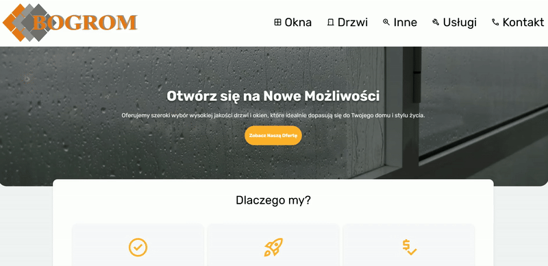
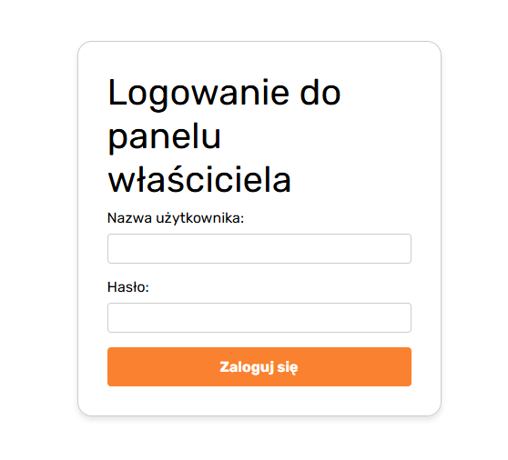
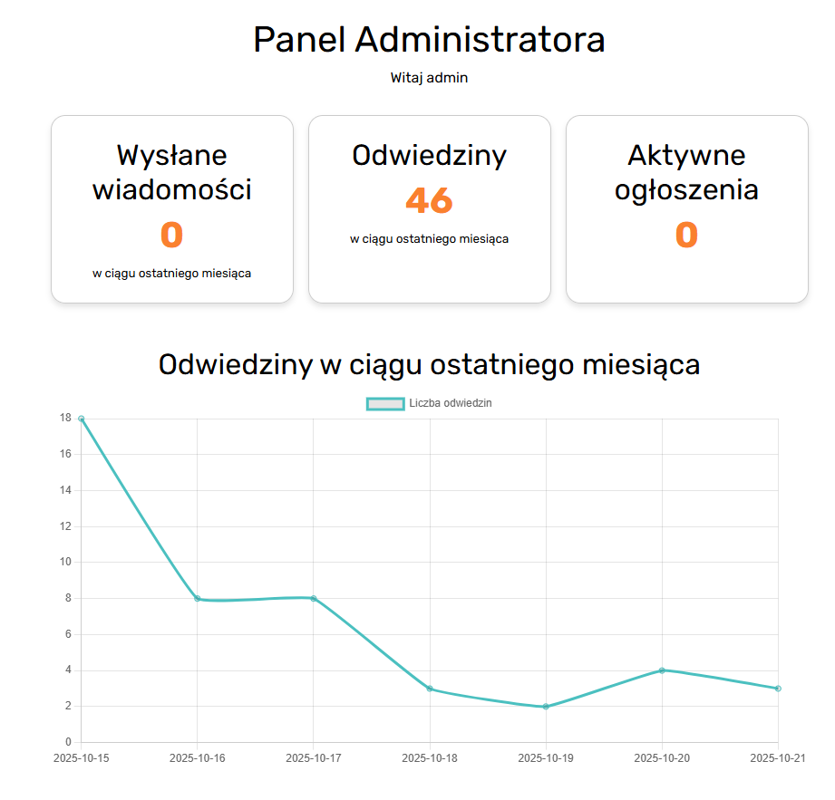
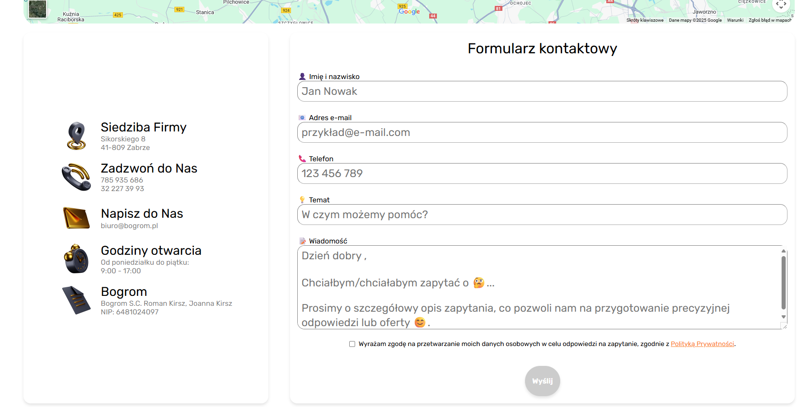
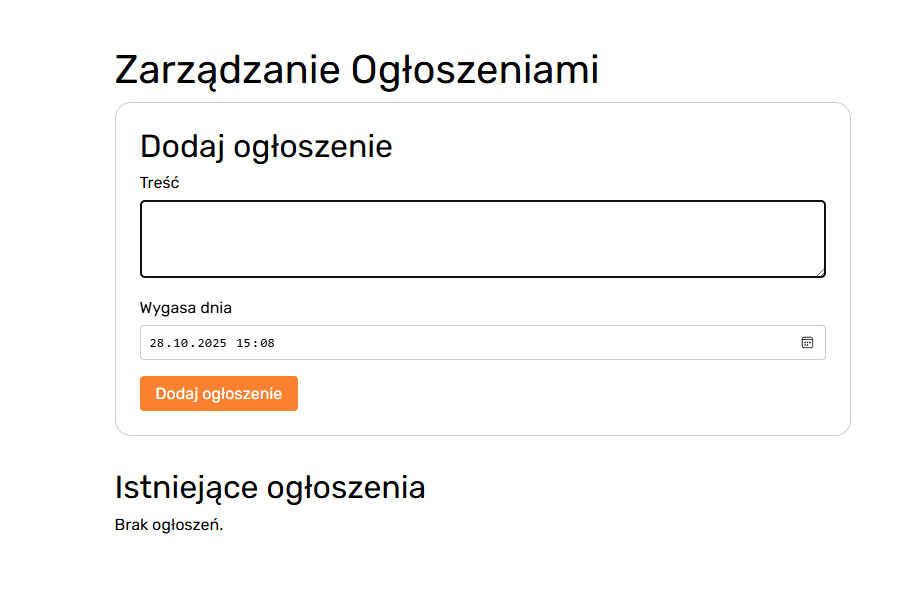
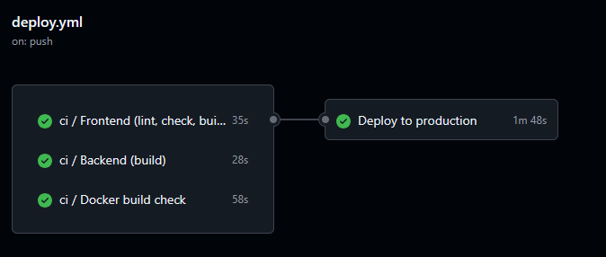

# 🌐 bogrom-site

**🔗Link to the working application:** [bogorm.pl](https://bogrom.pl)

Bogrom-Site - an online business card created and implemented by me from A to Z. <br><br>
The application runs on a VPS under its own domain and includes a simple administration panel for content management and basic authentication mechanisms.

## Screen shots



## ⚙️ Technology stack

Detailed list of technologies used in the project.

### 🎨 Frontend

- **Framework**: SvelteKit
- **Language**: TypeScript
- **Bundler**: Vite
- **Styling**: CSS
- **Server WWW**: Nginx (as reverse proxy)

### 🛠️ Backend

- **Runtime**: Node.js
- **Framework**: Express.js
- **Język**: TypeScript
- **ORM**: Prisma
- **API**: REST

### 💾 Database

- **System**: PostgreSQL

### 🏗️ Infrastructure & Deployment

- **Containerization**: Docker, Docker Compose
- **Hosting**: VPS
- **Certificate SSL**: Let's Encrypt z Certbot
- **CI/CD**: GitHub Actions
- **Implementation automation**: Skrypty Bash (`deploy.sh`)

## 🧩 Functionality

- **User Login**: Login to the admin panel using JWT
  
- **Activity tracking**: Tracking user activity/visits on the website
  
- **Email**: cleint can send an email via the website
  
- **Announcements**: Owner/Admin can post an announcements on website
  

## 🚀 Local launch

Instructions on how a developer can run the project on their machine.

1.  **Clone the repositrory:**

    ```bash
    git clone https://github.com/xPietrUx/bogrom-site
    ```

2.  **Configure environment variables:**
    Copy the `.env.example` file to `.env` and fill it with the appropriate values.

    ```bash
    cp .env.example .env
    ```

3.  **Run the application with Docker Compose:**
    This command will build images and run all containers (frontend, backend, database).

    ```bash
    docker-compose up --build
    ```

4.  The application will be available at `http://localhost:PORT_FRONTEND`.

## 📦 Deployment process

The application is hosted on a VPS server and deployed using Docker. The pipeline is automated with GitHub Actions and the `deploy.sh` script.



1.  **CI** (`.github/workflows/ci.yml`) runs on every pull request and before each deployment:
    - Lints, type-checks and builds the Frontend
    - Builds the Backend and generates the Prisma client
    - Verifies the Docker images build successfully

2.  **CD** (`.github/workflows/deploy.yml`) triggers on every push to `main`, once CI passes:
    - Connects to the VPS over SSH
    - Pulls the latest `main` branch
    - Runs the `deploy.sh` script, which:
        - Removes existing docker images
        - Builds new images for Frontend, Backend, Database
        - Launches Certbot for SSL certification
        - Populates the database with users from seed

3.  The Nginx server acts as a reverse proxy, directing traffic to the appropriate containers.

4.  SSL certificates are managed automatically by Certbot, ensuring a secure HTTPS connection.
