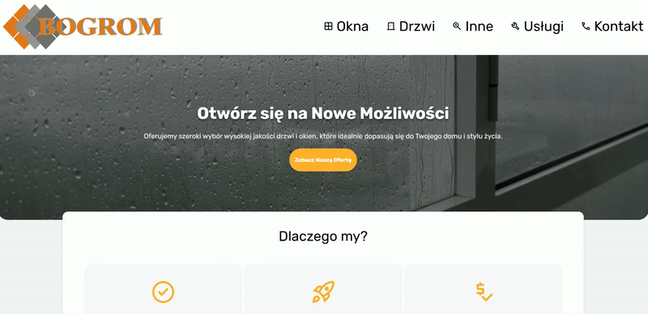

# 🌐 bogrom-site

**🔗Link to the working application:** [bogorm.pl](https://bogrom.pl)

Bogrom-Site - an online business card created and implemented by me from A to Z. <br><br>
The application runs on a VPS under its own domain and includes a simple administration panel for content management and basic authentication mechanisms.

## Screen shots



## ⚙️ Technology stack

Detailed list of technologies used in the project.

### 🎨 Frontend

-   **Framework**: SvelteKit
-   **Language**: TypeScript
-   **Bundler**: Vite
-   **Styling**: CSS
-   **Server WWW**: Nginx (as reverse proxy)

### 🛠️ Backend

-   **Runtime**: Node.js
-   **Framework**: Express.js
-   **Język**: TypeScript
-   **ORM**: Prisma
-   **API**: REST

### 💾 Database

-   **System**: PostgreSQL

### 🏗️ Infrastructure & Deployment

-   **Containerization**: Docker, Docker Compose
-   **Hosting**: VPS
-   **Certificate SSL**: Let's Encrypt z Certbot
-   **Implementation automation**: Skrypty Bash (`deploy.sh`)

## 🧩 Functionality

-   **User Login**: Login to the admin panel using JWT
    
-   **Activity tracking**: Tracking user activity/visits on the website
    
-   **Email**: cleint can send an email via the website
    
-   **Announcements**: Owner/Admin can post an announcements on website
    

## 🚀 Local launch

Instructions on how a developer can run the project on their machine.

1.  **Sklonuj repozytorium:**

    ```bash
    git clone https://github.com/xPietrUx/bogrom-site
    ```

2.  **Configure environment variables:**
    Copy the `.env.example` file to `.env` and fill it with the appropriate values.

    ```bash
    cp .env.example .env
    ```

3.  **Run the application with Docker Compose:**
    This command will build images and run all containers (frontend, backend, database).

    ```bash
    docker-compose up --build
    ```

4.  The application will be available at `http://localhost:PORT_FRONTEND`.

## 📦 Deployment process

The application is hosted on a VPS server and deployed using Docker. The process is automated using the `deploy.sh` script.

1.  After logging in to the VPS server, the `deploy.sh` script performs the following steps:

    -   Removes existing docker images
    -   Builds new images for Frontend, Backend, Database
    -   Launches Certbot for SSL certification
    -   Populates the database with users from seed

2.  The Nginx server acts as a reverse proxy, directing traffic to the appropriate containers.

3.  SSL certificates are managed automatically by Certbot, ensuring a secure HTTPS connection.
